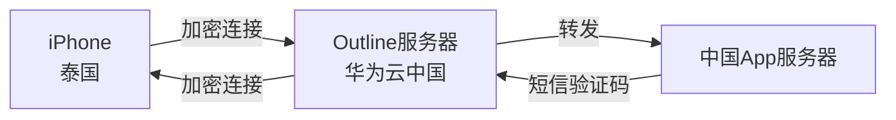

# 设计文档：一次性Outline VPN代理

## 概述

本设计描述了一个极简的一次性VPN代理方案，用于在泰国接收中国App的短信验证码。使用Outline（完全免费）部署在华为云中国区最小配置服务器上，用完即删。

**核心原则：**
- **极简**：一条命令部署，复制粘贴连接
- **极低成本**：最小服务器（约0.05-0.10元/小时），用完立即删除
- **一次性**：接收验证码后断开，删除服务器
- **免费软件**：Outline服务端和客户端完全免费

**技术选型：**
- **服务端**：Outline Server（免费开源）
- **客户端**：Outline Client for iOS（App Store免费）
- **服务器**：华为云中国区最小配置（1核1GB）
- **协议**：Shadowsocks（Outline内置）

## 架构

### 系统流程



### 核心组件

1. **华为云服务器**：最小配置Linux实例（1核1GB），运行Outline Server
2. **Outline Server**：Docker容器，处理流量转发和加密
3. **Outline Client**：iOS应用，建立加密隧道
4. **访问密钥**：一个ss://开头的字符串，包含所有连接信息

### 使用流程

**部署阶段（5分钟）：**
1. 在华为云创建最小配置服务器
2. SSH登录服务器
3. 运行一条安装命令
4. 复制输出的访问密钥

**使用阶段（1分钟）：**
1. 在iPhone上打开Outline应用
2. 粘贴访问密钥
3. 点击连接
4. 打开中国App接收验证码

**清理阶段（1分钟）：**
1. 在Outline应用中断开连接
2. 在华为云控制台删除服务器
3. 计费停止

## 组件详细设计

### 1. 华为云服务器配置

**最小规格：**
- **实例类型**：s6.small.1 或同等最小配置
- **CPU**：1核
- **内存**：1GB
- **存储**：20GB系统盘
- **操作系统**：Ubuntu 20.04 LTS（推荐）或CentOS 7
- **地域**：中国任意区域（选最便宜的）
- **网络**：分配公网IP

**安全组规则：**
- **入站**：允许UDP端口（Outline会随机选择一个高端口，如55555）
- **出站**：允许所有（默认）

**成本估算：**
- 按小时计费：约0.05-0.10元/小时
- 使用1小时总成本：约0.10元
- 使用24小时总成本：约2.40元

### 2. Outline Server安装

**一键安装命令：**
```bash
sudo bash -c "$(wget -qO- https://raw.githubusercontent.com/Jigsaw-Code/outline-server/master/src/server_manager/install_scripts/install_server.sh)"
```

**安装过程：**
1. 自动检测并安装Docker（如果未安装）
2. 下载Outline Server Docker镜像
3. 启动Outline Server容器
4. 生成随机端口和密码
5. 输出访问密钥（ss://格式）

**输出示例：**
```
CONGRATULATIONS! Your Outline server is up and running.

To manage your Outline server, please copy the following line (including curly brackets) into Step 2 of the Outline Manager interface:

{"apiUrl":"https://1.2.3.4:12345/xxxxxx","certSha256":"xxxxx"}

If you have connection problems, it may be that your router or cloud provider blocks inbound connections, even though your machine seems to allow them.

Make sure to open the following ports on your firewall, router or cloud provider:
- Management port 12345, for TCP
- Access key port 55555, for TCP and UDP
```

**访问密钥格式：**
访问密钥是一个ss://开头的字符串，例如：
```
ss://Y2hhY2hhMjAtaWV0Zi1wb2x5MTMwNTpteXBhc3N3b3Jk@1.2.3.4:55555/?outline=1
```

包含的信息：
- 加密方法：chacha20-ietf-poly1305
- 密码：mypassword（base64编码）
- 服务器IP：1.2.3.4
- 端口：55555

### 3. Outline Client使用

**iOS安装：**
1. 打开App Store
2. 搜索"Outline"
3. 下载"Outline - Secure internet access"（免费）
4. 安装到iPhone

**添加服务器：**
1. 打开Outline应用
2. 点击"+"或"添加服务器"
3. 选择"手动输入访问密钥"
4. 粘贴ss://开头的访问密钥
5. 点击"添加"

**连接使用：**
1. 在服务器列表中点击刚添加的服务器
2. 等待连接状态变为"已连接"（通常3-5秒）
3. 打开中国App，此时App会认为你在中国
4. 接收短信验证码
5. 完成后点击服务器断开连接

**连接状态：**
- 🔴 未连接：流量不经过VPN
- 🟡 连接中：正在建立连接
- 🟢 已连接：所有流量通过中国服务器

### 4. 网络流程

**连接建立：**
1. Outline Client向服务器IP:端口发起连接
2. 使用访问密钥中的密码进行认证
3. 建立加密隧道（Shadowsocks协议）
4. 连接成功

**流量转发：**
1. 中国App发送请求 → Outline Client拦截
2. Outline Client加密 → 发送到Outline Server
3. Outline Server解密 → 转发到中国App服务器
4. 中国App服务器响应 → Outline Server接收
5. Outline Server加密 → 发送回Outline Client
6. Outline Client解密 → 传递给中国App

**加密方式：**
- 算法：ChaCha20-IETF-Poly1305（移动设备优化）
- 认证：基于访问密钥中的密码
- 安全性：行业标准AEAD加密

## 数据模型

### 访问密钥结构

```typescript
interface AccessKey {
  // 完整的ss:// URL
  url: string;  // 例如: "ss://Y2hhY2hhMjA...@1.2.3.4:55555/?outline=1"
  
  // 解析后的组件
  server: string;      // 服务器IP，例如: "1.2.3.4"
  port: number;        // 端口，例如: 55555
  method: string;      // 加密方法，例如: "chacha20-ietf-poly1305"
  password: string;    // 密码（base64解码后）
}
```

### 连接状态

```typescript
enum ConnectionStatus {
  DISCONNECTED = "未连接",
  CONNECTING = "连接中",
  CONNECTED = "已连接"
}

interface ConnectionState {
  status: ConnectionStatus;
  serverName: string;  // 例如: "中国VPN"
  connectedAt?: Date;  // 连接时间
}
```


## 正确性属性

*属性是系统在所有有效执行中应该保持为真的特征或行为——本质上是关于系统应该做什么的正式声明。*

由于这是一次性使用的极简方案，我们只关注最核心的正确性保证：

### 属性 1：访问密钥解析

*对于任意*有效的Outline访问密钥（ss://格式），解析应该成功提取服务器地址、端口、加密方法和密码。

**验证需求：2.1, 2.2**

### 属性 2：连接后流量路由

*对于任意*已建立的连接，所有网络请求的源IP应该显示为中国服务器的IP地址。

**验证需求：3.1, 3.2**

## 错误处理

### 服务器端错误

**安装失败：**
- Docker未安装：安装脚本会自动安装Docker
- 端口被占用：脚本会选择另一个随机端口
- 权限不足：需要sudo权限（文档说明）

**运行时错误：**
- 无效客户端密码：拒绝连接
- 内存不足：不太可能发生（Outline很轻量）

### 客户端错误

**配置错误：**
- 访问密钥格式错误：显示"无效的访问密钥"
- 缺少必需字段：显示"访问密钥不完整"

**连接错误：**
- 服务器无法访问：显示"无法连接到服务器"
- 认证失败：显示"密码错误"
- 超时：30秒后显示"连接超时"

**恢复策略：**
- 连接失败：用户手动重试
- 服务器删除：用户删除客户端配置

## 测试策略

由于这是一次性使用的极简方案，测试策略也相应简化：

### 单元测试

**访问密钥解析：**
- 测试有效的ss:// URL解析
- 测试无效格式拒绝
- 测试特殊字符处理

**连接状态：**
- 测试状态转换（未连接→连接中→已连接）
- 测试断开连接

### 基于属性的测试

**测试配置：**
- **库**：根据实现语言选择（fast-check for TypeScript, Hypothesis for Python）
- **迭代次数**：每个属性测试最少100次
- **标记格式**：`Feature: china-vpn-proxy, Property X: [属性描述]`

**属性测试用例：**

1. **访问密钥解析属性**（属性1）
   - 生成随机有效访问密钥
   - 验证所有解析成功
   - 验证提取的组件正确
   - **标记**：`Feature: china-vpn-proxy, Property 1: Access Key Parsing`

2. **流量路由属性**（属性2）
   - 生成随机连接状态
   - 验证已连接时流量通过服务器
   - 验证未连接时流量不通过服务器
   - **标记**：`Feature: china-vpn-proxy, Property 2: Traffic Routing After Connection`

### 手动测试

**端到端验证：**
1. 部署服务器并获取访问密钥
2. 在iPhone上连接
3. 检查IP地址是否显示为中国
4. 打开中国App接收验证码
5. 断开连接并删除服务器

这个手动测试是最重要的验证，因为它测试了真实的使用场景。
